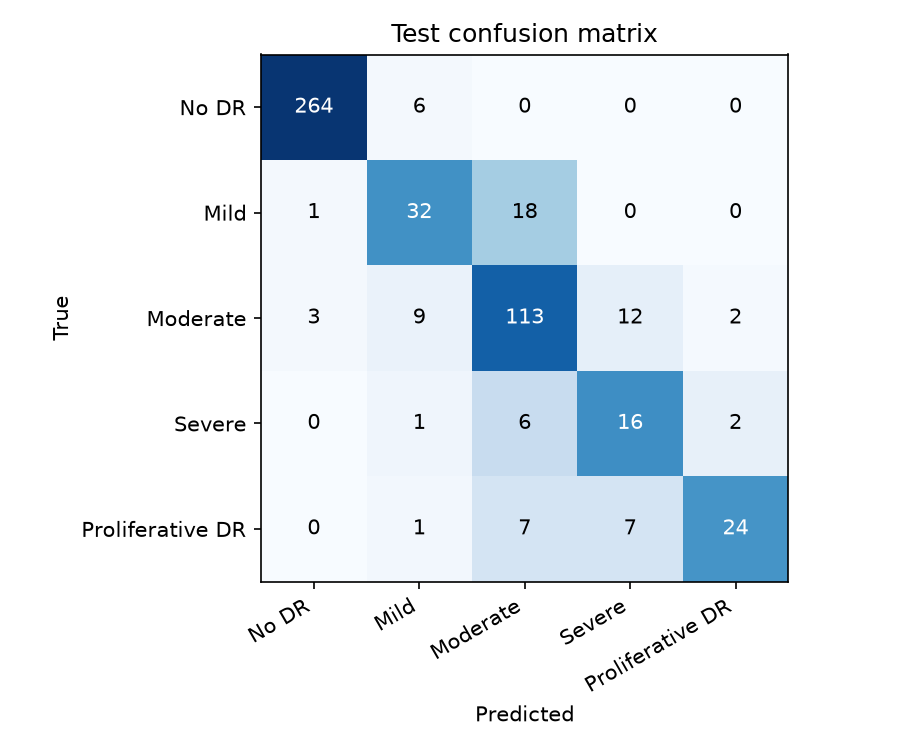
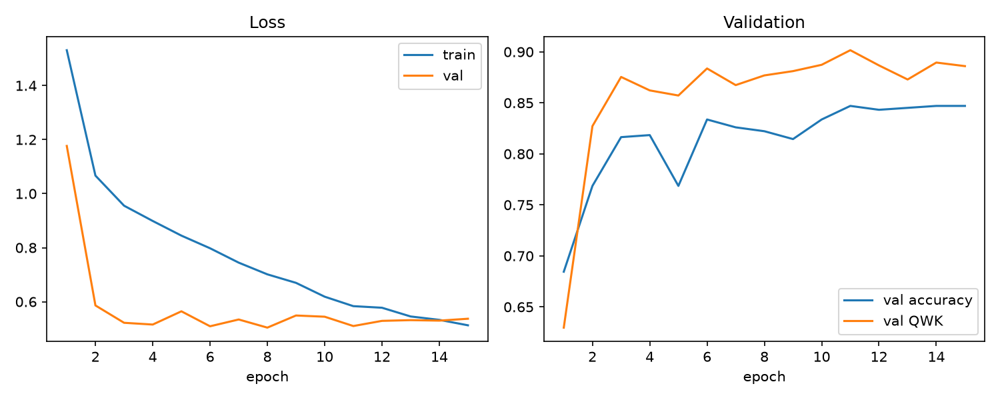
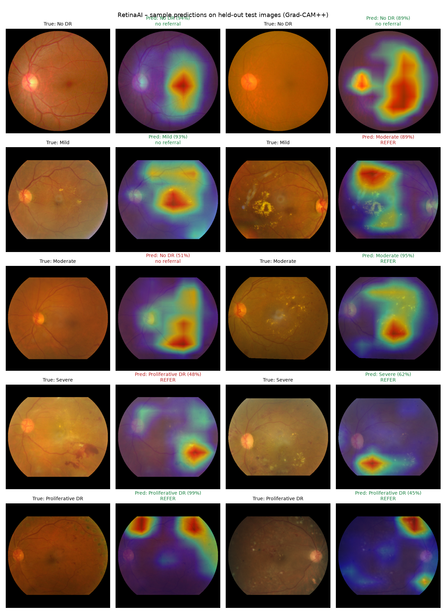

<p align="center">
  
</p>

<h1 align="center">RetinaAI</h1>
<p align="center"><b>Explainable diabetic retinopathy screening for primary health centres</b></p>

<p align="center">
  EfficientNet-B0 · Transfer learning · Grad-CAM++ · Temperature scaling · FastAPI · Next.js
</p>

---

Diabetic retinopathy (DR) is a leading cause of preventable blindness. Early screening prevents most vision loss,
but rural India has very few ophthalmologists. **RetinaAI** lets a health worker upload a retinal (fundus) photo
and get:

- the **DR grade** (0 No DR · 1 Mild · 2 Moderate · 3 Severe · 4 Proliferative)
- a **calibrated confidence** score
- a **Grad-CAM++ heat-map** showing *where* the model looked
- a **plain-language explanation**
- a **referral recommendation**
- a **PDF report**, saved to a dashboard that tracks follow-up

It also runs an **image-quality check** and an **"is this really a fundus photo?"** check (K-NN out-of-distribution
detection), so it does not grade a blurry photo or a selfie.

> Semester project for **UML501 Machine Learning**, built around problem statement SIH 2026 PS-26038.

---

## Results

All numbers are on a **held-out test set of 524 images** that the model never saw during training or tuning.

| Metric | Value |
|---|---:|
| **Quadratic Weighted Kappa (QWK)** | **0.927** |
| Accuracy (5 grades) | 85.7 % |
| Macro-F1 | 0.734 |
| **Referable DR sensitivity** (grade ≥ 2) | **93.1 %** |
| Referable DR specificity | 95.0 % |
| Referable DR precision | 92.2 % |
| Referable DR ROC-AUC | 0.985 |
| Expected calibration error | 4.8 % |
| CPU inference (ONNX) | ≈ 12 ms / image |

For context, a QWK above 0.90 is typical of strong entries in the APTOS 2019 Kaggle competition.

### Model comparison (same test split)

| Model | Family | Test QWK | Test accuracy |
|---|---|---:|---:|
| Hand-crafted colour/lesion features + XGBoost | Classical ML, no deep learning | 0.771 | 73.5 % |
| CNN embeddings + Logistic Regression | Transfer learning + linear model | 0.906 | 84.0 % |
| CNN embeddings + XGBoost | Transfer learning + boosting | 0.922 | 86.5 % |
| CNN embeddings + SVM (RBF) | Transfer learning + kernel method | 0.929 | 85.3 % |
| **Fine-tuned EfficientNet-B0 (ours)** | Deep learning, end-to-end | **0.927** | **85.7 %** |

Learned CNN features beat hand-crafted features by about +0.15 QWK, which shows why deep learning is needed here.
Classical classifiers trained on top of those features perform about the same as the CNN's own classifier layer.
The embeddings come from the fine-tuned network, so the cross-validation scores reported in
`reports/baselines.json` are optimistic. The test QWK in this table is the fair comparison.

### Per-class performance (test set)

| Grade | n | Sensitivity | Specificity | Precision | F1 |
|---|---:|---:|---:|---:|---:|
| No DR | 270 | 97.8 % | 98.4 % | 98.5 % | 0.981 |
| Mild | 51 | 62.7 % | 96.4 % | 65.3 % | 0.640 |
| Moderate | 139 | 81.3 % | 92.0 % | 78.5 % | 0.799 |
| Severe | 25 | 64.0 % | 96.2 % | 45.7 % | 0.533 |
| Proliferative DR | 39 | 61.5 % | 99.2 % | 85.7 % | 0.716 |

Most errors fall between **neighbouring** grades, such as Mild vs Moderate. Doctors find these hard to tell apart
too, and QWK penalises such errors lightly.

<p align="center">
  
  
</p>

### Explainability: Grad-CAM++ on test images

<p align="center">
  
</p>

More examples with the generated explanations are in **[docs/sample_results.md](docs/sample_results.md)**.

---

## How it works

```
fundus photo
   │
   ├─► quality check ── blur (Laplacian variance), exposure, contrast, framing
   │
   ├─► preprocessing ── crop black border → pad to square → 512 px
   │                    → Ben Graham local-contrast filter (mask-normalised) → circular mask
   │                    → standardise with ImageNet mean/std
   │
   ├─► EfficientNet-B0 ── test-time augmentation (original + 2 flips), averaged
   │        │
   │        ├─► temperature-scaled softmax ──► grade + calibrated confidence
   │        ├─► P(grade ≥ 2) vs. tuned threshold ──► referral decision
   │        ├─► 1280-d embedding ──► K-NN distance ──► out-of-distribution warning
   │        └─► Grad-CAM++ on the last conv block ──► heat-map ──► text explanation
   │
   └─► FastAPI ──► SQLite + PDF report ──► Next.js website
```

### Model details

| | |
|---|---|
| Architecture | EfficientNet-B0 (MBConv blocks, batch normalisation, SiLU, squeeze-excitation), ImageNet pre-trained |
| Head | Dropout(0.3) → Linear(1280 → 5) |
| Parameters | 4.0 M |
| Input | 320 × 320 RGB, Ben Graham enhanced |
| Loss | Cross-entropy with square-root inverse-frequency class weights + label smoothing 0.05 |
| Optimiser | AdamW, lr 3e-4, weight decay 1e-4, gradient clipping 2.0 |
| Schedule | 1 epoch linear warm-up, then cosine decay; backbone frozen for epoch 1 |
| Augmentation | Random resized crop, horizontal and vertical flips, 360° rotation, colour jitter |
| Training | 15 epochs, batch 16, Apple M-series GPU (MPS), about 35 min; best epoch (11) chosen by validation QWK |
| Calibration | Temperature scaling fitted on the validation set (T = 1.0; the model was already well calibrated) |
| Referral threshold | 0.56 on P(referable), chosen on validation for ≥ 90 % sensitivity |
| Export | ONNX (16 MB) for offline CPU use |

### Data

[APTOS 2019 Blindness Detection](https://www.kaggle.com/competitions/aptos2019-blindness-detection): 3,662 fundus
photos from Aravind Eye Hospital, India, each graded 0–4 by ophthalmologists.

| Step | Result |
|---|---|
| Duplicate detection (vessel-pattern fingerprint correlation) | 130 duplicate groups found, 37 of them with **conflicting labels** |
| Removed | 175 images (conflicting duplicates are dropped entirely; otherwise the sharpest copy is kept) |
| Clean dataset | 3,487 images |
| Stratified split | 2,440 train / 523 validation / 524 test |
| Class balance | No DR 51 % · Mild 10 % · Moderate 26 % · Severe 5 % · Proliferative 8 % |

Duplicates are removed **before** splitting. Otherwise the same eye could appear in both train and test, which is
data leakage.

### Unsupervised analysis

The 1280-d CNN embeddings are reduced with PCA (2 components explain 44 % of variance) and visualised with t-SNE.
Agglomerative (Ward) clustering reaches an **ARI of 0.52** against the true grades without ever seeing the labels.
DBSCAN marks 188 atypical images as noise. The same density idea drives the app's out-of-distribution guard.

---

## Website

| Page | What it shows |
|---|---|
| **Screening** | Upload, grade, confidence, heat-map viewer (fade slider, original / enhanced / heat-map), explanation, referral, PDF report |
| **Dashboard** | Screening volume, referral rate, per-centre table, follow-up tracking |
| **Model** | Every metric and chart above, interactive |
| **Login / Register** | Role-based sign-in; patients can create their own account |
| **My Reports** | A patient's own screening history, with heat-maps and PDFs |
| **Users** | Admin manages all accounts; a hospital manages its doctors |

### Accounts and access control

Every page except Home and Model needs a login. Each role sees only what it is allowed to:

| Role | Can do | Sees |
|---|---|---|
| **Patient** | Register themselves, read and download their reports | Only their own screenings |
| **Doctor** | Screen patients (link the screening to a patient account) | Only screenings they performed |
| **Hospital** | Screen patients, add and remove its own doctors | Screenings done at that hospital |
| **Admin** | Manage all accounts, delete records | **All records** |

How it is secured:

- Passwords are stored as salted **PBKDF2-SHA256** hashes (200,000 iterations), never in plain text.
- Login returns a random 256-bit session token that expires after 7 days.
- Every API request is checked on the server against the user's role. Asking for a record you are not allowed to
  see returns "not found".

On the first start, demo accounts are created: `admin / admin123`, `hospital1 / hospital123`, `doctor1 / doctor123`
and `patient1 / patient123`. Change or delete them for real use.

### RetinaAI assistant (chatbot)

The chat button at the bottom-right of every page opens a small **offline** assistant. It needs no internet or API
key:

- It has a hand-written knowledge base of about 25 question/answer pairs about DR, the app, the model and privacy.
- Your question and every stored question are turned into **TF-IDF vectors** (word n-grams plus character n-grams,
  so small typos still match).
- The best answer is found by **cosine similarity**, i.e. 1-nearest-neighbour search.
- If nothing is similar enough, it says it doesn't know instead of guessing.
- "My latest result" answers from the logged-in user's own records, following the same access rules as the rest of
  the app.

<!-- Add your own screenshots to docs/images/ and uncomment:
<p align="center">
  
  
</p>
-->

---

## Project structure

```
RetinaAI/
├── retina/                  core ML package (shared by training and the web app)
│   ├── config.py            paths, class names, hyper-parameters
│   ├── preprocessing.py     crop, Ben Graham / CLAHE, mask
│   ├── quality.py           blur / exposure / framing check
│   ├── dataset.py           PyTorch Dataset, augmentation, class weights
│   ├── model.py             EfficientNet-B0 transfer-learning model
│   ├── gradcam.py           Grad-CAM and Grad-CAM++ from scratch (PyTorch hooks)
│   ├── explain.py           heat-map → plain-language explanation
│   ├── metrics.py           QWK (from scratch), sensitivity/specificity, ECE, referral metrics
│   ├── calibration.py       temperature scaling
│   └── inference.py         end-to-end predictor used by the API
├── scripts/
│   ├── 01_download_data.py      Kaggle API data collection
│   ├── 02_prepare_data.py       clean, de-duplicate, enhance, split
│   ├── 03_train.py              fine-tune (watchdog + resume support)
│   ├── 03b_calibrate.py         recalibrate an existing checkpoint
│   ├── 04_evaluate.py           test metrics, figures, embeddings
│   ├── 05_baselines.py          LR / SVM / XGBoost baselines, PCA, DBSCAN, hierarchical clustering
│   ├── 06_export_onnx.py        offline / edge deployment
│   ├── 07_sample_predictions.py sample results for this README
│   └── train_overnight.sh       unattended training with auto-resume
├── backend/                 FastAPI server: auth.py (login/roles), db.py (SQLite), chatbot.py, PDF reports
├── frontend/                Next.js 15 + Tailwind CSS website
├── models/                  trained checkpoint, ONNX model, training embeddings
├── reports/                 metrics JSON and figures
└── docs/                    syllabus mapping (TOPICS.md), sample results
```

See **[docs/TOPICS.md](docs/TOPICS.md)** for how each technique maps to the UML501 syllabus and why it was chosen.

---

## Quick start

### macOS / Linux

```bash
git clone https://github.com/bhargavchetanya/RetinaAI.git
cd RetinaAI
python3 -m venv .venv && source .venv/bin/activate
pip install -r requirements.txt          # macOS: brew install libomp (needed by XGBoost)
bash start_app.sh                        # backend :8000 + website :3000
```

Open **http://localhost:3000**. The trained model is included in `models/`, so no training is needed to try the
website. You need Node.js 18+.

### Windows

Use **Command Prompt** or **PowerShell**. You need [Python 3.10+](https://www.python.org/downloads/) (tick *"Add python.exe to PATH"* during install), [Node.js 18+](https://nodejs.org/) and [Git](https://git-scm.com/download/win).

```bat
git clone https://github.com/bhargavchetanya/RetinaAI.git
cd RetinaAI
py -m venv .venv
.venv\Scripts\activate
pip install -r requirements.txt
start_app.bat
```

`start_app.bat` opens the backend in a second window and runs the website in the first. Open **http://localhost:3000**.

In PowerShell, run `.venv\Scripts\Activate.ps1` instead of `.venv\Scripts\activate`. If PowerShell says *"running scripts is disabled"*, run
`Set-ExecutionPolicy -Scope CurrentUser RemoteSigned` once.

To start the two servers manually in two terminals:

```bat
:: terminal 1
.venv\Scripts\activate
python -m uvicorn backend.main:app --port 8000

:: terminal 2
cd frontend
npm install
npm run dev
```

On Windows the model runs on the **CPU**, or on an NVIDIA GPU if you install the CUDA build of PyTorch
([pytorch.org](https://pytorch.org/get-started/locally/)).

### Re-train from scratch

```bash
# 1. dataset (Kaggle API token in ~/.kaggle/kaggle.json)
python scripts/01_download_data.py
# 2. full pipeline: prepare -> train -> evaluate -> baselines -> ONNX
python scripts/02_prepare_data.py
caffeinate -dimsu bash scripts/train_overnight.sh      # macOS; on Linux drop "caffeinate -dimsu"
# Windows: run the steps one by one instead
#   python scripts/03_train.py --num-workers 0
#   python scripts/04_evaluate.py
#   python scripts/05_baselines.py
#   python scripts/06_export_onnx.py
python scripts/07_sample_predictions.py
```

---

## Limitations

- Trained on a **single dataset** (one hospital network, similar cameras). Performance on smartphone fundus
  adapters or other populations is untested.
- Rare grades (Mild, Severe, Proliferative) have far fewer examples, so their per-class recall is lower (about 62–64 %).
- The lesion words in the explanation, such as "exudates", come from colour/morphology heuristics inside the
  hot region. They are hints, not lesion segmentation.
- This is an educational prototype, **not a medical device**, and it has not been clinically validated.

## Acknowledgements

- APTOS 2019 dataset: Aravind Eye Hospital and Kaggle
- Tan & Le, *EfficientNet* (2019) · Selvaraju et al., *Grad-CAM* (2017) · Chattopadhay et al., *Grad-CAM++* (2018)
  · Guo et al., *On Calibration of Modern Neural Networks* (2017) · Ben Graham, Kaggle DR 2015 preprocessing
